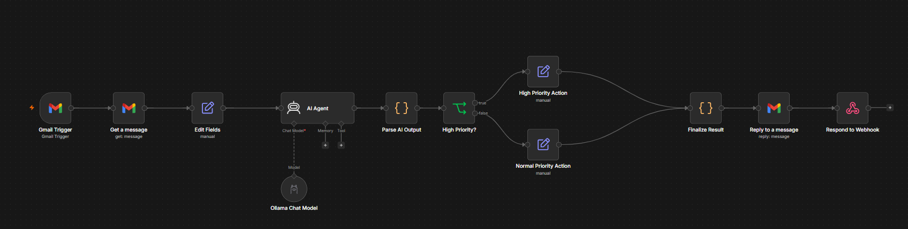

# AI Email Assistant Agent

An automated email triage and response system built with [n8n](https://n8n.io/), a local LLM (via [Ollama](https://ollama.com/)), and the Gmail API. It reads incoming emails, classifies them, judges urgency, drafts a professional reply, and sends it automatically — with high-priority emails flagged for escalation.

## What it does

1. **Watches a Gmail inbox** for new incoming messages (polls every minute).
2. **Extracts** the subject, body, and sender from the email.
3. **Sends the email to an AI agent** (running `llama3.2:3b` locally via Ollama) which:
   - Classifies the email into one category: `Billing`, `Technical Support`, `Account`, `Sales`, `Complaint`, `General Inquiry`, or `Other`.
   - Assigns a priority: `Low`, `Medium`, or `High`, based on strict rules (e.g. account compromise or fraud is always High; a routine refund request is not).
   - Writes a concise summary of the request.
   - Drafts a professional reply — without inventing policies, refund approvals, or information not present in the original email.
4. **Parses and validates** the AI's structured output.
5. **Routes the email** down one of two paths based on priority:
   - **High priority** → marked `URGENT`, flagged for escalation.
   - **Normal priority** → processed and replied to automatically.
6. **Sends the AI-drafted reply** back to the original sender via Gmail, preserving the original subject line.
7. **Returns a structured JSON result** (used for testing/logging via a webhook response node).

## Architecture

The workflow follows a simple linear pipeline with one conditional branch for priority routing:

**Gmail Trigger → Get message → Extract fields → AI Agent (Ollama) → Parse output → Priority branch (High / Normal) → Finalize result → Auto-reply via Gmail → Respond to webhook**

## Tech stack

- **[n8n](https://n8n.io/)** — workflow orchestration
- **[Ollama](https://ollama.com/)** running **llama3.2:3b** — local LLM, no external API costs
- **Gmail API (OAuth2)** — reading and replying to emails
- **JavaScript (n8n Code nodes)** — output parsing and validation

## Setup

1. Install [n8n](https://docs.n8n.io/hosting/installation/) and [Ollama](https://ollama.com/download) locally.
2. Pull the model: `ollama pull llama3.2:3b`
3. Import `workflow.json` into your n8n instance.
4. Configure your own credentials in n8n (not included in this repo):
   - **Gmail OAuth2** — connect your Gmail account under n8n's Credentials panel.
   - **Ollama** — point n8n to your local Ollama instance (default: `http://localhost:11434`).
5. Activate the workflow. It will begin polling the connected Gmail inbox every minute.

> **Note:** No credentials, API keys, or personal data are included in `workflow.json`. You must connect your own Gmail account and Ollama instance after importing.

## Example

**Incoming email:**
> Subject: Can't log into my account
> Body: "I think someone else accessed my account. I need to change my password immediately."

**AI output:**
- **Category:** Account
- **Priority:** High
- **Summary:** Customer reports unauthorized access to their account and requests an immediate password change.
- **Status:** Flagged `URGENT` for escalation.
- **Reply (auto-sent):** A professional acknowledgment asking the customer to confirm their identity and outlining next steps, without inventing any company policy.

## Limitations

- Runs on a small local model (`llama3.2:3b`), so classification and writing quality are good for a portfolio demo but not as strong as a larger hosted model (e.g. GPT-4 or Claude).
- Polling-based (checks Gmail every minute) rather than event-driven via push notifications.
- "High priority" emails are flagged and auto-replied to, but not yet routed to a human inbox or alerting system (e.g. Slack) — this would be a natural next step.
- No persistent logging or database; each run is stateless.
- Built and tested for a single Gmail inbox; not multi-tenant.

## Possible next steps

- Swap Ollama for a hosted LLM API for higher-quality responses.
- Add Slack/email alerting for high-priority escalations instead of just auto-replying.
- Add a lightweight log (e.g. Google Sheets or a database) to track processed emails over time.

---

Built as a demonstration of a real, working AI automation pipeline: **trigger → AI reasoning → conditional logic → action**.
